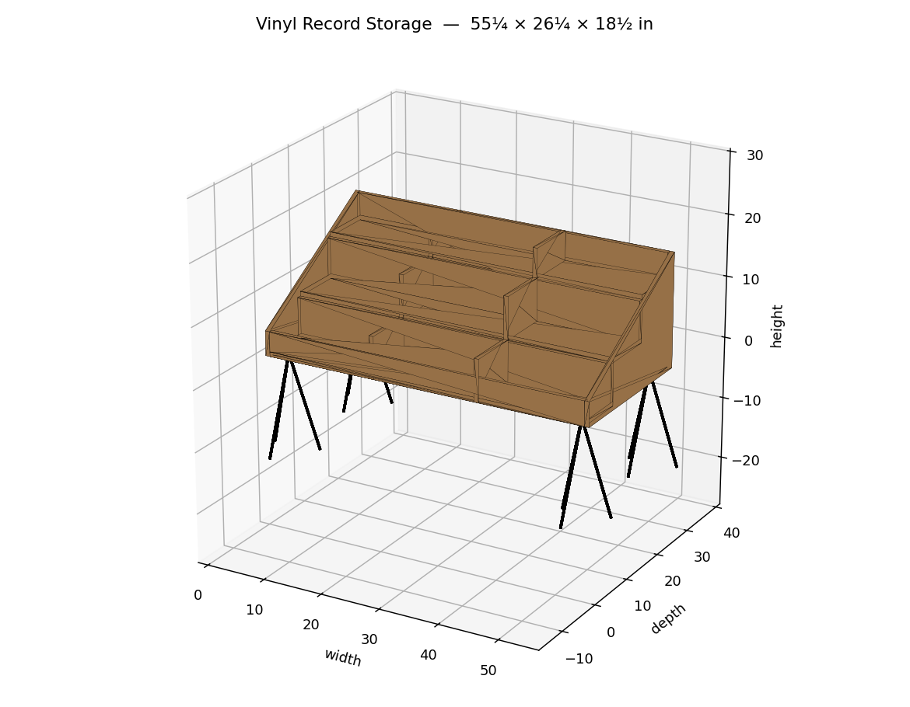

# Vinyl Record Storage — 3D Model

A parametric 3D model of the **Jen Woodhouse "Vinyl Record Storage"** stepped
record bin, recreated in Python from the published dimensions.

Reference: <https://jenwoodhouse.com/vinyl-record-storage/>



## Design

A stepped ("stadium seating") record bin on hairpin legs. The back wall is full
height and the interior descends toward the front in three tiers. Each tier is a
shelf where LP records lean back so you can flip through them, and each tier is
split into compartments by vertical dividers. The outer side panels are a clean
wedge — low at the front, tall at the back.

### Overall dimensions

| | inches |
|---|---|
| Width | 55¼ |
| Depth | 26¼ |
| Box height | 18½ |
| Material | ¾″ plywood |
| Legs | 16″ hairpin (4 × 3-rod) |

## Usage

```bash
pip install numpy trimesh shapely
python src/record_storage.py     # exports models/*.stl, *.obj, *.glb

pip install matplotlib
python src/render.py             # writes renders/*.png
```

The model is fully parametric — edit the constants at the top of
`src/record_storage.py` to change the width, depth, height, material thickness,
number of tiers, or dividers per tier and everything rebuilds.

## Outputs

- `models/vinyl_record_storage.stl` — solid mesh (3D print / CAD)
- `models/vinyl_record_storage.obj` — mesh with materials
- `models/vinyl_record_storage.glb` — coloured scene (viewers / web)
- `renders/` — matplotlib preview PNGs

## Repository layout

```
src/         model + render scripts
models/      exported meshes (STL / OBJ / GLB)
renders/     preview images
reference/   source plan thumbnail
```

> Dimensions match the published Jen Woodhouse plan; internal tier/divider layout
> is a faithful parametric reconstruction, not an exact copy of the original cut
> list. For the official step-by-step build instructions and hardware list, see
> the source plan linked above.
